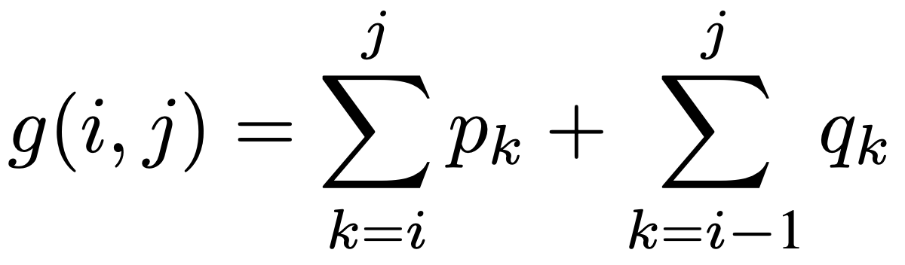

As a reference and introduction to this code you can read the [following slides](http://www.cs.tut.fi/~elomaa/teach/AADS-2014-8.pdf). The notation in the slides is different than my code. On slide 534 on page 10: root 2D triangle = r 2D vector, w 2D triangle = g 2D vector, e 2D triangle = z 2D vector.

The vectors k, p and q are given. 2D vectors g, z and r need to be calculated for the construstion of the Optimal Binary Search Tree. A few bullet points to explain the code:

- k is a vector that represents the values of the keys in ascending order. Index 0 of the vector is discarded because there are n keys but n+1 leaves and we need the vector of p to have an equal size to q.
- p is a vector that represents the probability of a key being searched. Index 0 of the vector is discarded because there are n keys but n+1 leaves and we need the vector of p to have an equal size to q.
- q is a vector that represents the probability of a leave being searched. Leaves represents all the values that are not keys. E.g.: if we have three keys: 5, 10 and 15. Then there would be four leaves that represent: the numbers that are smaller than 5, the numbers in between 5 and 10, the numbers in between 10 and 15 and the numbers that are bigger than 15.
- g is a 2D vector that represents the cost of a subtree without taking into account that the weight of nodes deeper in the tree should be higher. This means that the probalities of all the keys and leaves in the subtree are summed, which means that the g cost of the tree will always be 1.
- z is a 2D vector that represents the cost of each of the possible subtrees. By calculating this cost, beginning from the costs which are given in p and q, it becomes possible to obtain the total cost of the Optimal Binary Search Tree.
- r is a 2D vector that represents the root nodes of the Optimal Binary Search SUBtrees. This vector is recursively used to construct the Optimal Binary Search Tree.

Formula to calculate the cost of the g subtree:

Formula to calculate the cost of the z subtree (the minimum value is saved into the r 2D vector as the optimal root of that subtree):
